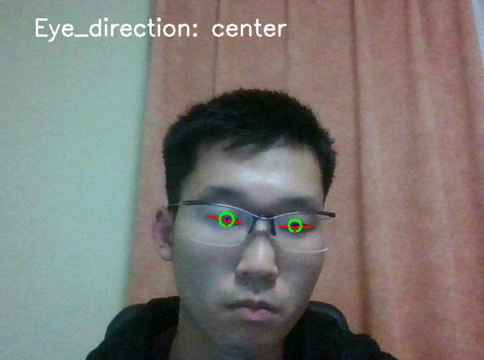
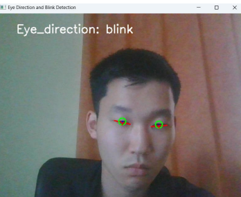
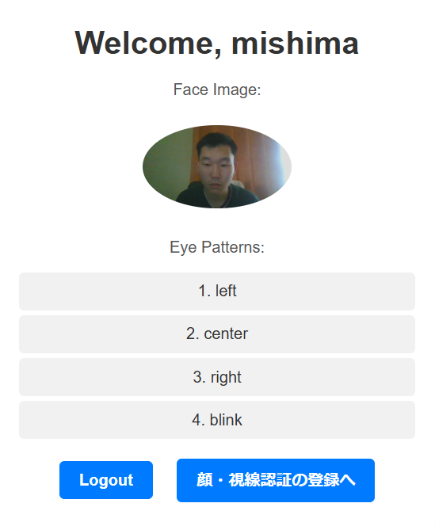
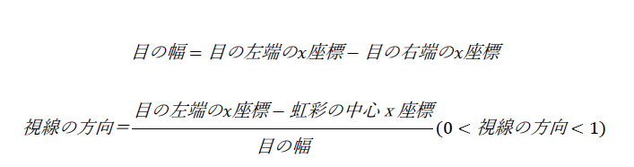

# face-recoginition
顔認証と視線認証を行って、ログインをすることができるアプリ

## アプリの概要

顔・視線認証が行えるアプリとなっています。

とくに、このアプリでは視線認証において視線の方向だけでなく、まばたきでの入力も行えるようにすることで、目を動かすのが難しい人や斜視の方でもより気軽に目線認証を行えるようにしました。

アプリの流れは以下のようになっています。

1. ユーザは、自分の顔写真と視線入力のパターンを入力します。
2. その後、ログアウトをして、顔・視線認証でログインを行います。
3. 登録したユーザの顔写真と類似する顔があれば、顔認証が完了して、目線認証に移ります。
4. 顔認証したユーザの目線のパターンと一致する視線の動きをした場合に、目線認証が完了してホーム画面に遷移します。

以下のように、目線認証では、向いている方向が画面に表示されます。

以下の画像では真ん中を向いているため、画面の上部に「center」と表示されます。

また、以下のようにまばたきをすると、システムが検知して「blink」と表示されます。

目線認証が完了すると、以下のようにユーザの情報が記載されたホーム画面に遷移します。

## 作ろうと思った動機

近年では、顔認証を使った本人の確認が、銀行のATMシステムや自動入国審査、スマートフォンのログインなどで広く使われるようになっています。ただし、既存の人物の顔画像や動画を合成してあたかも本人のように見せかける技術であるディープフェイクを使って、他人の顔認証が行われてしまうというセキュリティ上のリスクが顕在します。

このようなディープフェイクによるセキュリティリスクに対応するために、顔認証だけに頼らずに、指紋や持ち物などの認証要素を組み合わせる多要素認証が有効的と言われています。そこで、今回は顔認証に加えて、目線認証でユーザの本人確認を行うシステムを開発することで、顔認証で起こるディープフェイクの問題を解決しようと試みました。

また、最近私が読んだ川上未映子著の「ヘブン」では、斜視の少年が登場してきており、そこで斜視の人が目線を意識的に動かすことが難しいことを知ったため、目線認証にてまばたきも含めることで斜視のように目を動かすことが困難な人にも対応できるようにしました。

参考:

[顔認識システムに対する敵対的攻撃の脅威調査 AIディフェンス研究所_2021年2月24日](https://jpsec.ai/adversarial-face-recognition-survey/)

[ディープフェイクの脅威と顔認証の未来：求められる多要素認証_RADIX](https://www.radix.ad.jp/support/news/view/1297)

## 開発環境

- OS：Windows11
- プログミング言語：Python
- フレームワーク：Flask
- 主なライブラリ：face_recognition(顔認証)、open_cv(内蔵カメラでの撮影、目線の描画等)、mediapipe(顔の特徴量抽出)
- データベース：SQLite
- カメラ：内蔵カメラ（富士通のノート PC に搭載されているカメラ）

## データベース設計

User テーブル
- id
- username（ユーザ名）
- password（パスワード）
- face_image（顔写真のファイルが格納されている場所、例:static/uploads/faces/…）
- eye_pattern_1(目線認証の 1 パターン目、例えば center,left,right,blink などの視線の情
報が入る)
- eye_pattern_2(目線認証の 2 パターン目)
- eye_pattern_3(目線認証の 3 パターン目)
- eye_pattern_4(目線認証の 4 パターン目)

eye_pattern_1～eye_pattern_４は、ユーザの目線認証の各回数の動作を表しており、認証で行われる動作の回数を４つに固定しました。ここで、動作の回数を４つという固定したパターン数にした理由としては、実装を行う上でユーザごとに目線認証のパターン数を決定すると、認証の実装をする際に、認証した回数をユーザごとに管理できるようにする必要があり、実装の手間がかかるからです。また、データベース設計においても、各ユーザの視線認証のパターン数が異なる場合には、ユーザと各認証の動作を紐づける外部テーブルを用意したり、または NoSQL を実装して異なる回数でもデータを格納できるようにしたりするといった実装コストがかかるため、今回の実装では、目線認証の回数を４つに固定しました。

## 認証に使った関数の紹介

目線認証では主に以下の記事を参考にして開発をしました。

- [まばたきを検知するPythonコードの解説_yKesamaru](https://zenn.dev/ykesamaru/articles/f10804a8fcc81d)
- [スマホの画面注視認識機能を簡易実装する_yKesamaru](https://zenn.dev/ykesamaru/articles/6e2098dbef148e)

[gaze_recognition_utils.py](https://github.com/mametaro99/face-recoginition/blob/main/my_flask_app/gaze_recognition_utils.py)

上記でのソースコードでは、ユーザの目線を検知して、ユーザの登録した目線のパターンと一致するかどうかを確かめるコードとなっています。

上記の顔認証のソースコードで使われている主な関数についての説明を行います。

### perform_gaze_recognition(user)

[perform_gaze_recognition(user)](https://github.com/mametaro99/face-recoginition/blob/eab553c762f9f325eed6d8db90fdf305567fbc2f/my_flask_app/gaze_recognition_utils.py#L179)では、引数として User クラスで作成された user を受け取っています。この関数では、ライブラリであるmediapipeを使って、ユーザの顔やパーツを識別し、openCV を使って目線、目・瞳孔の輪郭を描画しています。

そして、0.8 秒ごとにユーザの目線の情報を検知して、user に含まれる eye_pattern1 から pattern4 までの視線の情報と連続で一致した場合に True を返すようになっています。ここで、0.8 秒の間に、目が開いた状態から目が閉じて、再び目が開いた場合にまばたきと検出されます。

### get_eye_direction (eye_start, eye_end, iris_center)

[get_eye_direction (eye_start, eye_end, iris_center)](https://github.com/mametaro99/face-recoginition/blob/eab553c762f9f325eed6d8db90fdf305567fbc2f/my_flask_app/gaze_recognition_utils.py#L54)では、引数に MediaPipe で取得した eye_start(目の左端の座標), eye_end（目の右
端の座標）, iris_center(虹彩の中心座標)を受け取り、視線の向いている方向を戻り値として
返すプログラムです。そして、以下の式により、目の位置がどこにあるかを特定します。

ここで、求めた視線の方向が 0 に近い値だと視線が左を向いていて、0.5 に近い値だと中央を見ていて、1 に近い値だと右を向いていることになります。ここで、本プログラムで視線の方向については、0.4 未満であると左を向いていて、0.6 より大きいと右を向いているという判定にしました。

### calculate_eye_ratio(face_landmarks, eye_landmarks)

[calculate_eye_ratio(face_landmarks, eye_landmarks)](https://github.com/mametaro99/face-recoginition/blob/eab553c762f9f325eed6d8db90fdf305567fbc2f/my_flask_app/gaze_recognition_utils.py#L168)では、引数にMediaPipeで取得した各顔 のパーツの座標が格納されたface_landmarksと、face_landmarksにおける複数の目の位置（目の上縁、下縁、左端、右端）の添え字が格納された eye_landmarks を受け取り、アスペクト比（目の開き具合）を計算して目が閉じているかどうかを判定する関数です。

ここで、目の開き具合を目の位置（目の上縁、下縁、左端、右端）もとに眼の開き具合 EAR(Eye Aspect Ratio: EAR)を算出する。EAR は、目が開いている時には大きくなり、目が閉じてい
る時には小さくなるため、本プログラムでは以下のように[目が開いているか、閉じているかどうかを識別するための閾値](https://github.com/mametaro99/face-recoginition/blob/eab553c762f9f325eed6d8db90fdf305567fbc2f/my_flask_app/gaze_recognition_utils.py#L20)を設定して

EAR_THRESHOLD_CLOSE = 1.6
EAR_THRESHOLD_OPEN = 1.3

計測された目の開き具合 EAR をもとに、目が開いているか閉じているかを判定しています。

## 感想
今回は、顔認証に加えて、目線認証を行って自動ログインを行えるシステムを作ってみました。

本システムを使って、実際に目線認証でログインを行ったところ、なかなか４つの目線の動作を連続で行うことが難しく、目線認証のログインを行うのに 10 分程度かかってしまい、認証システムとしての不便さを感じるとともに、目の疲れを感じました。また、家族の協力の元、私以外の２人にこの目線認証を行ってもらいましたが、一人は２分以内に完了したものの、もう一人はなかなかできずに呆れてしまって途中でリタイアしてしまいました。

本システムで目線認証を上手く行えない理由としては以下の３点が考えられます。

- 視線を動かすことに慣れていないため、目線認証の動作通りに目を動かせない。
- 0.8 秒間隔で目線の読み取りを行っているため、認証を行っている本人がパターン通りに
眼を動かしたとしても、読み取っていない場合が多い。
- まばたきを読み取れるようにしているために、認証中に自然に行ってしまう意図しないまばたきが検知されてしまい、パターン通りに認証が行えない場合がある。

上記の点を含めて、使い勝手の良い認証システムを作れているとは言い難いですが、まばたき検知を行って斜視などの目を動かしにくい人でも使うことができ、多要素認証を考慮したセキュリティの高い認証システムを作ることができました。

## 参考にした記事

### 顔認証

- [【Python】お手軽に顔認証を実装する1_k-keita](https://qiita.com/k-keita/items/e27e4eefc8c009ecdeab)

### 目線認証

- [まばたきを検知するPythonコードの解説_yKesamaru](https://zenn.dev/ykesamaru/articles/f10804a8fcc81d)
- [スマホの画面注視認識機能を簡易実装する_yKesamaru](https://zenn.dev/ykesamaru/articles/6e2098dbef148e)

## Flask

[【初心者向けWebサイト開発】FlaskとSQLデータベースを連携させよう](https://beginner-engineer-study.com/flask-database/)